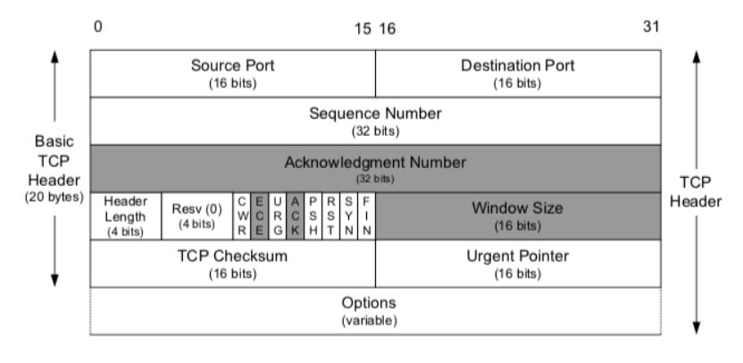
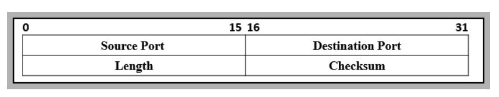

# TCP와 UDP

> 네트워크 계층 중 전송 계층에서 사용하는 프로토콜

## UDP(User Datagram Protocol)

- 데이터를 데이터그램 단위로 처리하는 비연결형 프로토콜
- 흐름제어, 오류제어 또는 손상된 세그먼트 수신에 대한 재전송을 하지 않음
- CheckSum 필드를 통해 최소한의 오류 검출

## TCP(Transmission Control Protocol)

- 인터넷 상에서 데이터를 메세지의 형태(세그먼트)로 보내기 위해 Ip와 함께 사용하는 프로토콜
- IP가 데이터의 배달을 처리한다면 TCP는 패킷을 추적 및 관리
- 연결형 서비스로 가상 회선 방식을 제공
  - 3-way handshaking 과정을 통한 연결, 4-way handshaking을 통한 해제
  - 기본적으로 full-duplex, point-to-point 방식 -> 멀티캐스팅이나 브로드캐스팅을 지원하지 않는다.
- 흐름제어 및 혼잡제어를 제공
  - 흐름제어
    - 데이터의 처리 속도를 조절하여 수신자의 버퍼 오버플로우를 방지하는 것
    - 송신하는 곳의 속도를 조절하여 수신하는 곳에서의 문제를 막는 것
  - 혼잡제어
    - 네트워크 내의 패킷 수를 조절하는 것
    - 패킷을 조금만 전송하여 혼잡 붕괴 현상이 일어나는 것을 막음

## TCP와 UDP의 차이점

| TCP                                   | UDP                                   |
| ------------------------------------- | ------------------------------------- |
| 높은 신뢰성  속도가 느리다  | 낮은 신뢰성  속도가 빠르다  |

### TCP 헤더와 UDP 헤더

#### TCP Header

- Source Port, Destination Port (16bit)- TCP로 연결되는 양단의 송수신 프로레스 포트 주소
- Sequence Number(32bit) - 송신자가 지정하는 순서 번호 SYN=1:초기 번호, ACK = SYN+1
- Acknowledgement Number/ACK(32bit) - 수신 프로세스가 수신한 바이트의 수에 대한 응답
- Header Length(Data Offset)(4bit) - TCP 헤더 길이 4바이트 단위로 표시(20~60)
- Resv(Reserved)(4bit) - 나중을 위해 0으로 채워진 예약 필드
- Window Size(16bit) - 수신 윈도우의 버퍼 크기 지정(**0이면 송신 중지**) 상대방의 확인 없이 전송 가능한 최대 바이트 수
- TCP Checksum(16bit) - 헤더와 데이터의 에러 확인 용도
- Urgent Pointer(16 bit) - 현재 번호부터 표시된 바이트까지 긴급한 데이터 임을 표시, URG 플래그 비트와 함께 사용
- Options(0~40) - 추가 옵션 있을 경우 표시
- Flag Bits
  - URG - Urgent Pointer 사용 여부 설정
  - ACK - 응답 유효 여부, SYN 패킷 이후 모든 패킷은 ACK설정 필요, 데이터를 잘 받았다면 긍정으로 ACK(SYN+1) 전송
  - PSH - 수신측에 버퍼링된 데이터를 상위 계층에 즉시 전달할 때
  - RST - 연결 리셋 응답 or 유효하지 않은 세그먼트 응답
  - SYN - 연결 설정 요청, 양쪽의 최초 패킷에만 설정
  - FIN - 연결 종료 의사 표시

#### UDP Header

- Source Port , Destination Port(16bit) - 송수신 어플리케이션이 포트 번호
- Length(16bit) - 헤더와 데이터 포함 전체 길이
- Checksum - 헤더와 데이터의 에러 확인 용도

## TCP의 3-way handshake와 4-way handshake

#### 3-way handshake

- TCP 통신을 이용하기 위해서 연결을 설정하는 과정
- 양쪽 모두 데이터를 전송할 준비가 되었다는 것을 보장
- TCP/IP 프로토콜을 이용해서 통신을 하는 응용 포그램이 전송 전 세션을 수립하는 과정
  - Client가 Server에 연결을 요청
    1. Client -> Server: SYN 전송
       - Client가 연결 요청 메시지 전송(SYN)
       - 임의의 시작 Sequence Number와 SYN flag bit를 1로 설정한 후 전송
       - PORT 상태 - Server: LISTEN, Client: CLOSED
    2. Server -> Client: SYN + ACK
       - 요청을 받은 Server가 요청을 수락하며 A에게도 포트 개방 요청을 위한 메시지를 전송(SYN + ACK)
       - PORT 상태 - ServerL: STN_RCV, Client: CLOSED
    3. Client -> Server: ACK
       - PORT 상태 - Server: SYN_RCV, Client: ESTABLISHED
       - 마지막으로 Client가 수락 확인을 보내 연결을 맺음(ACK)
       - PORT 상태 - Server: ESTABLISHED, Client: ESTABLISHED
  - 참고 - ***포트(PORT) 상태 정보***
    - CLOSED: 포트가 닫힌 상태
    - LISTEN: 포트가 열린 상태로 연결 요청 대기 중
    - SYN_RCV: SYNC 요청을 받고 상대방의 응답을 기다리는 중
    - ESTABLISHED: 포트 연결 상태

#### 4-way handshake

- TCP의 연결을 해제(Connection Termination)하는 과정
  - Client가 Server에 연결 해제를 요청
    1. Client -> Server: FIN
       - Client가 연결을 종료하겠다는 FIN flag를 전송
       - Server가 FIN flag로 응답하기 전까지 연결을 계속 유지
    2. Server -> Client: ACK
       - Server는 일단 ACK를 보내고 자신의 통신이 끝날 때까지 대기(TIME_WAIT)
       - 그리고 자신이 전송할 데이터가 남아있다면 이어서 계속 전송한다.
    3. Server -> Client: FIN
       - Server가 통신이 끝났으면 연결 종료에 동의한다는 의미로 FIN flag를 전송
    4. Client -> Server: ACK
       - 프로세스 A는 확인했다는 ACK를 전송

## TCP 관련 질문

1. TCP의 3-way handshake와 4-way handshake의 단계가 차이나는 이유?
   - Client만 데이터 전송을 완료하여 종료요청을 보냈더라도 Server에도 아직 보낼 데이터가 남아 있을 수 있기 때문에 ACK만 보낸 후 데이터를 모두 전송한 후에 FIN을 보내기때문에 한단계가 추가된다.
2. Server에서 FIN flag를 전송하기 전에 전송한 패킷이 Routing 지연이나 패킷 유실로 인한 재전송 등으로 인해 FIN패킷보다 늦게 도착하면?
   - FIN flag를 수신하더라도 일정 시간 동안 세션을 남겨 놓고 패킷을 기다린다. (TIME_WAIT)
3. 초기 Sequence Number를 0부터 시작하지 않고 난수를 생성해서 설정하는 이유?
   - SYN을 보고 패킷을 구분하는데 순차적으로 진행하면 이전 통신에서 오는 패킷으로 인식할 수 있기때문에 문제가 발생할 가능성을 줄이기 위해서 난수로 설정한다.

