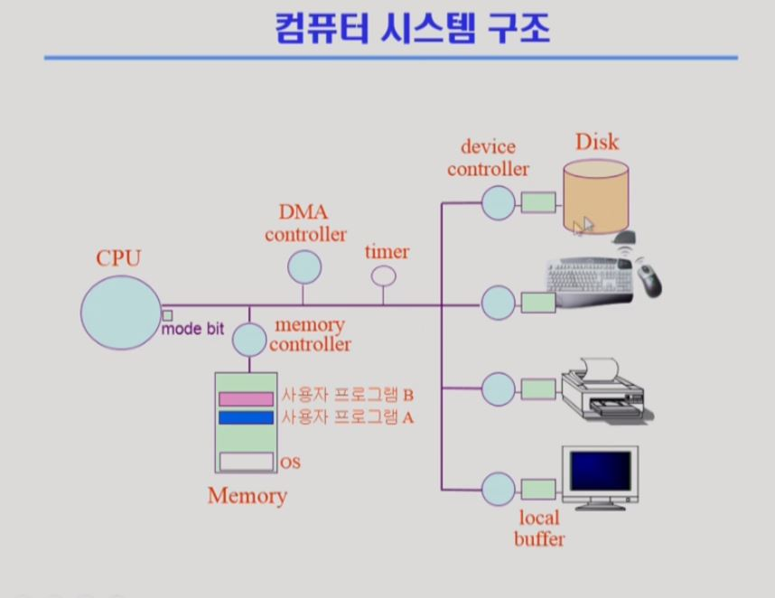

# 컴퓨터 구조와 프로그램 실행(1)

## 컴퓨터 시스템 구조

### timer

특정 프로그램이 시스템을 독점하지 않도록 막는 역할 - 시분할

시간이 되면 인터럽트 발생시킴

### Device controller

**각각의 I/O device에 붙어있는 전담 CPU** -  각각의 device를 통제하는건 CPU가 아닌 Device controller가 하는 일

이런 device controller의 작업공간(memory)를 local buffer라 함

### CPU

- memory에서 매 순간 다음 instruction을 읽어서 수행하기만 함 

- register - memory보다 더 빠른 작은 저장 공간

- mode bit - cpu에서 실행되는 것이 운영체제인지 사용자 프로그램인지 구분짓는 역할

- interrupt line - memory가 아닌 다른 장치들에게 요청을 보내고 완료 응답을 받는 수단, 스케쥴링이나 입출력 등에 사용 (입출력은 프로그램이 요구하지만 이런 요구때는 직접 요청하지 못하고 운영체제로 cpu를 넘겨줘야만 가능하도록 되어 있다. - mode bit)

  

### Memory

- CPU의 작업 공간

### DMA (Direct Memory Access)

- 너무 잦은 Interuppt발생이 CPU의 동작을 방해하는 것을 막아줌
- CPU대신 I/O 작업을 메모리에 직접 처리한 뒤 모두 처리한 후 CPU에 알리는 방식

### I/O 수행 

- system call로 요청 - systemcall이란 ? 사용자 프로그램이 운영체제의 서비스를 받기 위한 interrupt(소프트웨어 인터럽트) 요청 
- cpu를 받은 os가 I/O를 수행
