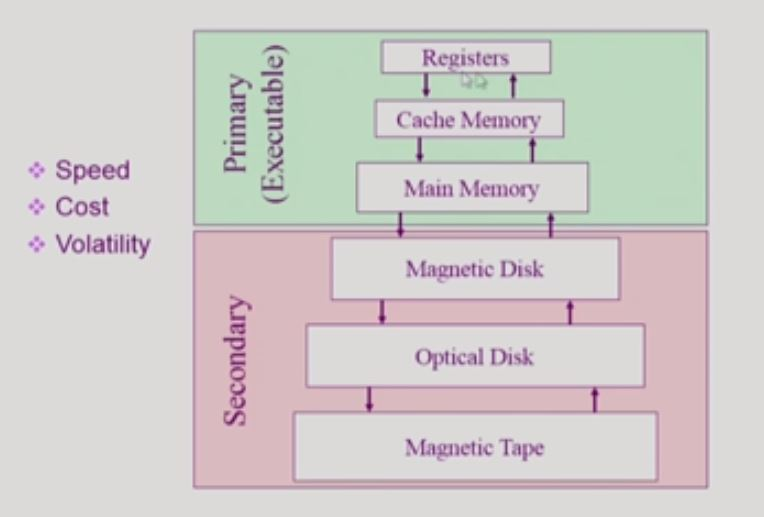

# 시스템 구조와 프로그램 실행(2)

 ## 동기식 입출력과 비동기식 입출력

- 동기식 입출력(Synchronous)

  > I/O 요청 후 입출력 작업이 완료된 후에 제어가 사용자 프로그램에게 넘어감

- 비동기식 입출력(Asynchronous)

  > I/O요청 후 작업이 끝나길 기다리지 않고 제어를 사용자 프로그램에게 돌려줌

두경우 다 인터럽트가  알려줌

## DMA

> Direct Memory Access

- 입출력 장치를 메모리에 가까운 속도로 처리하기 위해 사용
-  CPU의 중재없이 device controller가 device의 buffer storage의 내용을 메모리에 block단위로 직접 전송
- 바이트 단위가 아니라 block 단위로 인터럽트를 발생시킴

## 서로 다른 입출력 명령어

1. special instruction에 의해 - 메모리 접근과 I/O 명령을 따로 구분
2. Memory Mapped I/O에 의해 - 메모리 접근과 I/O 명령을 따로 구분하지 않고 메모리 주소에 따라 구분

## 저장장치 계층 구조

> 위로 갈수록 속도가 빠른 장치를 사용하며 대신 비싸기 떄문에 용량은 작아짐

Primary는 CPU가 직접 접근이 가능한 매체를 의미하며 휘발성이다.

Secondary는 CPU가 직접 접근하지 못하며 비휘발성인 매체이다.

## 프로그램의 실행(메모리 load)

File system -> [virtual memory] -> Physical memory

Virtual memory는 code, data, stack으로 구성되며 각 프로그램마다 독자적으로 생성

Memory에 올라와 있거나 Swap area에 위치시켜 필요한 데이터를 사용

#### 커널 주소 공간의 내용

- code
  - 시스템콜, 인터럽트 처리코드
  - 자원 관리를 위한 코드
  - 서비스를 위한 코드
- data
  - 하드웨어를 관리하는 자료구조
  - PCB(Process Control Block) - 프로그램을 관리하기  위한 자료구조
- stack
  - 각 프로그램들이 커널을 사용할 때 관리되는 프로그램 커널 stack

## 사용자 프로그램이 사용하는 함수

- 함수(function)
  - 사용자 정의 함수
  - 라이브러리 함수
  - 커널 함수

- 프로그램의 실행
  - user mode와 kernal mode의 반복 - 커널함수의 실행으로 system call이 일어났을 경우마다

