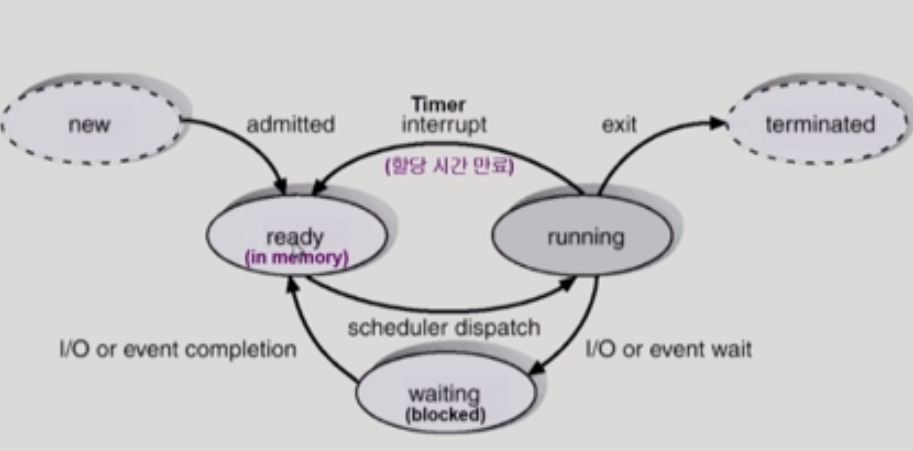
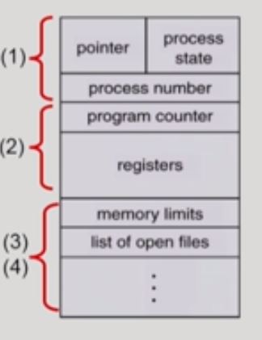

# 프로세스

## 프로세스의 개념

> 실행중인 프로그램

- 프로세스의 문맥(context)
  - CPU수행 상태를 나타내는 하드웨어 문맥 - pc, register
  - 프로세스의 주소 공간 - code, data, stack
  - 프로세스 관련 커널 자료 구조 - PCB, Kernel stack

## 프로세스의 상태 (Process State)

- 프로세스는 상태가 변경되며 수행된다.
  - Running
    - CPU를 차지하여 수행중인 상태
  - Ready
    - CPU를 기다리는 상태(메모리 등 다른 조건은 모두 만족)
  - Blocked (wait, sleep)
    - CPU를 주어도 당장 수행할 수 없는 상태
    - Process 자신이 요청한 event가 즉시 만족되지 않아 기다리는 상태(ex) I/O
    - ex) 디스크에서 file을 읽어와야 하는 경우
  - Suspended(stopped) - 중기 스케줄러 때문에 존재하는 상태
    - 외부적인 이유로 프로세스의 수행이 정지된 상태
    - 프로세스는 통째로 디스크에 swap out된다
    - 사용자나 시스템이 프로세스를 정지하는 경우(사용자의 종료, 메모리에 너무 많은 프로세스가 올라와 있을 때)
  - 그외
    - New: 프로세스가 생성중인 상태
    - Terminated: 수행이 끝난 상태
- 프로세스의 상태도

## Process Control Block(PCB)

- PCB
  - 운영체제가 각 프로세스를 관리하기 위해 프로세스당 유지하는 정보
  - 구성요소
    - OS가 관리하는 정보: Process state, Process ID, scheduling information, priority
    - CPU 수행 관련 하드웨어 값: PC, register
    - 메모리 관련: Code, data, stack의 위치 정보
    - 파일 관련: Open file descriptors

## 문맥 교환(Context Switch)

- CPU를 다른 프로세스로 넘겨주는 과정
- CPU가 다른 프로세스에게 넘어갈때 일어나는 일
  - CPU를 내어주는 프로세스의 상태를 PCB에 저장
  - CPU를 얻은 프로세스는 PCB에서 읽어옴

- System call이나 interrupt 발생시 반드시 context switch가 일어나는 것은 아님
  - CPU가 운영체제로 넘어갈 때는 context switch가 일어나지는 않음(PCB save는 필요하지만 부담이 적음)
  - 운영체제가 같은 프로세스로 다시 CPU를 넘기게되면 context switch가 일어난 것이 아님

## 프로세스를 스케쥴링하기 위한 큐

- Job queue: 현재 시스템 내에 있는 모든 프로세스의 집합
- Ready queue: CPU를 할당받기를 기다리는 프로세스의 집합
- Device queue: I/O device의 처리를 기다리는 프로세스의 집합
- 프로세스들은 각 큐들을 오가며 수행됨

## 스케쥴러 (Scheduler)

- Long-term scheduler(장기 스케줄러 or job scheduler)
  - 시작 프로세스 중 어떤 것들을 ready queue로 보낼지 결정
  - 프로세스에 memory(각종 자원)를 주는 문제
- Short-term scheduler(단기 스케줄러 or CPU scheduler)
  - 어떤 프로세스를 다음번에 running시킬지 결정
  - 프로세스에 CPU를 할당하는 문제
- Medium-term scheduler(중기 스케줄러 or Swapper)
  - 여유 공간 마련을 위해 프로세스를 통째로 메모리에서 디스크로 쫓아냄
  - 프로세스에게서 memory를 뺏는 문제

